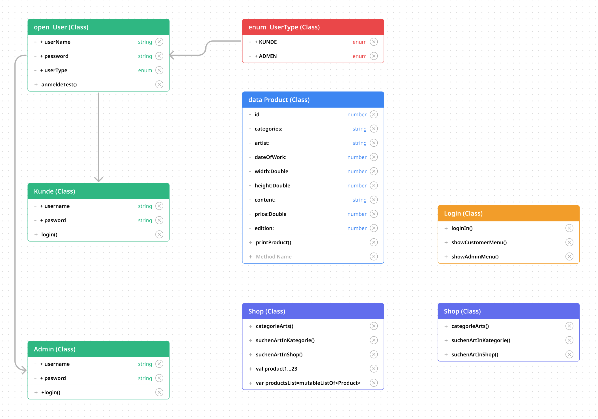

# Syntax Praxis Project "appArt"
___
### Willkommen zum Kunden-Interface des Kotlin-Konsolenprogramms!
Mit diesem README erfahren Sie, wie Sie als Kunde die Kunstgalerie-Website verwalten können.
___
### Anmeldung
Zunächst müssen Sie sich mit Ihren Kundendaten einloggen. Hierbei werden Sie nach Ihrer Rolle,<br>
Ihrem Benutzernamen und Ihrem Passwort gefragt:
<br>

```Kotlin
println("Sind Sie ein Kunde oder ein Admin? (Geben Sie Kunde/Admin ein):")
val role = readln()
println("Bitte geben Sie Ihren Benutzernamen ein:")
val username = readln()
println("Bitte geben Sie Ihr Passwort ein:")
val password = readln()
```
<br>
Sollten Ihre Anmeldedaten nicht korrekt sein, werden Sie zur erneuten Eingabe aufgefordert:

```Kotlin
println("Login fehlgeschlagen. Bitte versuchen Sie es erneut.")
```

<br>
Bei erfolgreicher Anmeldung gelangen Sie zum Shop:

```Kotlin
println("Kunde hat sich erfolgreich eingeloggt und wird zum Shop weitergeleitet.")
```
### Kunden-Funktionen
Als Kunde haben Sie Zugriff auf folgende Funktionen:

Kunst von Künstler kaufen: Kaufen Sie Kunstwerke Ihrer Lieblingskünstler.
Kunst von Künstler aus Warenkorb löschen: Entfernen Sie Artikel aus Ihrem Warenkorb.
Mein Warenkorb: Betrachten Sie die Artikel in Ihrem Warenkorb.
Künstler suchen: Suchen Sie nach bestimmten Künstlern.
Beenden: Loggen Sie sich aus dem Kunden-Interface aus.
Um eine Funktion auszuwählen, geben Sie einfach die entsprechende Zahl ein,
wenn das Konsolenprogramm die Optionen anzeigt:

```Kotlin
println("Bitte wählen Sie eine Option:")
println("1. Kunst von Künstler kaufen")
println("2. Kunst von Künstler aus Warenkorb löschen")
println("3. Meine Warenkorb")
println("4. Künstler suchen")
println("5. Beenden")
```

Mit diesem Konsolenprogramm können Sie als Kunde einfach und effizient
durch die Kunstgalerie-Website navigieren und Ihre Lieblingskunstwerke kaufen.
Viel Spaß beim Stöbern und Kaufen mit Kotlin!
____

### Admin-Funktionen
Die Admin-Funktionen sind wie folgt:

Neue Kunst hinzufügen: Fügen Sie neue Kunstwerke zur Website hinzu.
Kunst löschen: Löschen Sie vorhandene Kunstwerke von der Website.
Alle Bestellungen anzeigen: Zeigen Sie alle Bestellungen an, die auf der Website getätigt wurden.
Beenden: Melden Sie sich von der Admin-Schnittstelle ab.
Um eine Funktion zu wählen, geben Sie einfach die entsprechende Zahl ein, 
wenn die Konsole die folgenden Optionen anzeigt:

```Kotlin
println("Bitte wählen Sie eine Option:")
println("1. Neue Kunst hinzufügen")
println("2. Kunst löschen")
println("3. Alle Bestellungen anzeigen")
println("4. Beenden")
```
<br>
Sollten Sie eine ungültige Auswahl treffen, fordert das Programm Sie auf, es erneut zu versuchen:

```Kotlin
println("Ungültige Auswahl. Bitte versuchen Sie es erneut.")
```
Mit diesem Konsolenprogramm haben Sie vollständige Kontrolle über die Inhalte 
der Kunstgalerie-Website und die Bestellungen der Kunden.
Viel Spaß beim Verwalten Ihrer Kunstgalerie mit Kotlin!


____

